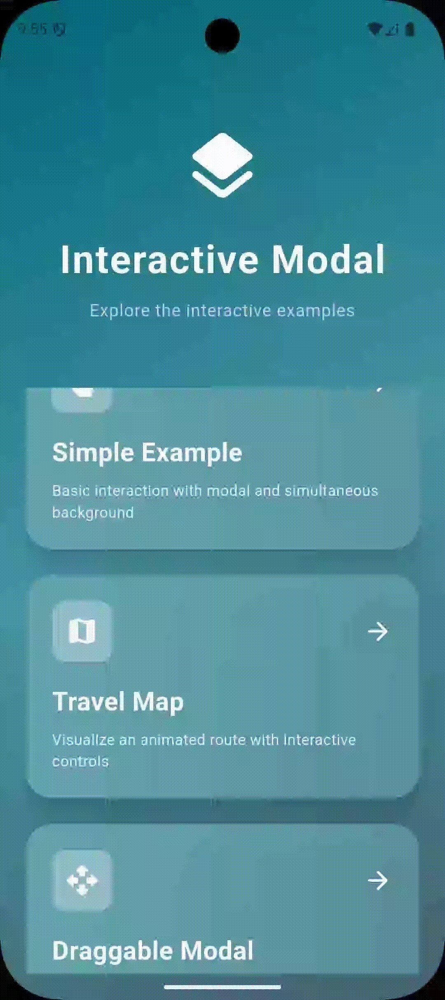
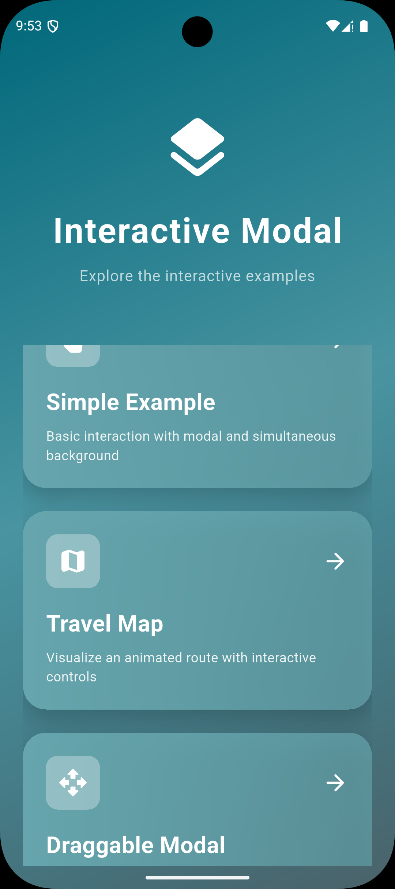
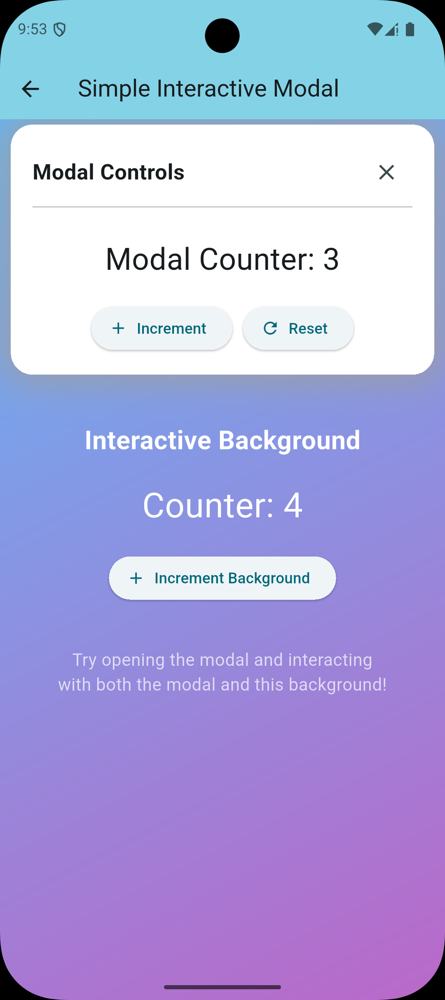
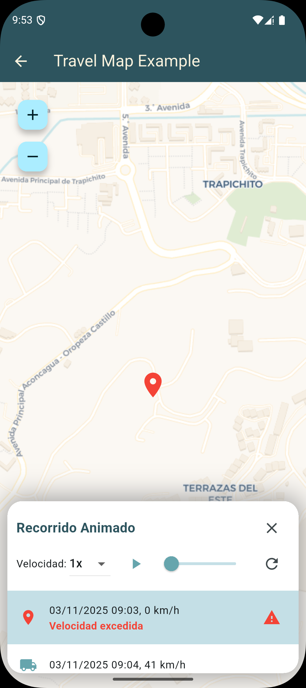
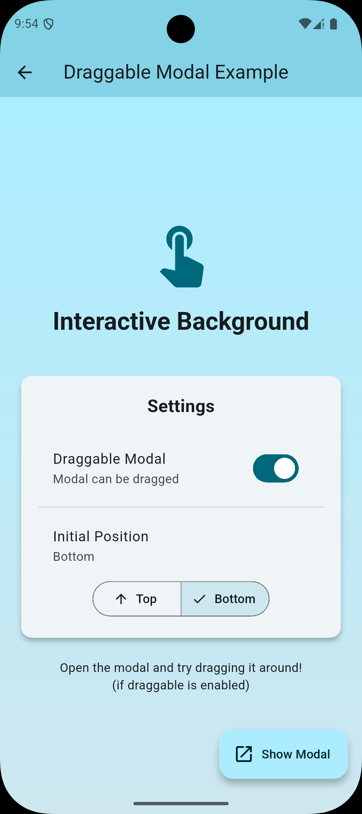

# Interactive Modal - Paquete Flutter

<div align="center">



</div>

Un paquete Flutter que permite mostrar un modal interactivo sobre contenido de fondo, manteniendo la capacidad de interactuar con ambos simultáneamente.

<div align="center">

[](https://pub.dev/packages/interactive_modal)
[](https://opensource.org/licenses/MIT)

</div>

## 🌟 Características Principales

- **Fondo Interactivo**: El widget de fondo permanece completamente funcional mientras el modal está visible
- **Posicionamiento Flexible**: Coloca el modal arriba, centro, abajo o en posición personalizada
- **Modal Arrastrable**: Opcionalmente permite arrastrar el modal para moverlo por toda la pantalla
- **Animaciones Suaves**: Transiciones animadas integradas con duración personalizable
- **Soporte de Temas**: Se adapta automáticamente a temas claro y oscuro
- **Responsive**: Funciona perfectamente en diferentes tamaños de pantalla
- **Fácil de Usar**: API simple basada en controladores
- **Backdrop Overlay**: Fondo semitransparente opcional con interacción dismissible
- **Indicador de Arrastre**: Indicador visual para modales arrastrables
- **Callbacks de Eventos**: Callbacks para mostrar, ocultar y eventos de arrastre
- **Sin Dependencias Externas**: Solo usa Flutter estándar (no requiere GetX)

## 📦 Instalación

Agrega esto al archivo `pubspec.yaml` de tu proyecto:

```yaml
dependencies:
  interactive_modal: ^0.1.0
```

Luego ejecuta:

```bash
flutter pub get
```

## 🚀 Uso Rápido

```dart
import 'package:flutter/material.dart';
import 'package:interactive_modal/interactive_modal.dart';

class MiPagina extends StatefulWidget {
  @override
  State<MiPagina> createState() => _MiPaginaState();
}

class _MiPaginaState extends State<MiPagina> {
  final InteractiveModalController _controller = InteractiveModalController();

  @override
  Widget build(BuildContext context) {
    return Scaffold(
      body: InteractiveModal(
        controller: _controller,
        background: Container(
          color: Colors.blue,
          child: Center(
            child: Text('Fondo Interactivo'),
          ),
        ),
        modalContent: Container(
          padding: EdgeInsets.all(20),
          child: Column(
            children: [
              Text('Contenido del Modal'),
              ElevatedButton(
                onPressed: () => _controller.hide(),
                child: Text('Cerrar'),
              ),
            ],
          ),
        ),
      ),
      floatingActionButton: FloatingActionButton(
        onPressed: () => _controller.show(),
        child: Icon(Icons.open_in_new),
      ),
    );
  }

  @override
  void dispose() {
    _controller.dispose();
    super.dispose();
  }
}
```

## 📖 Documentación Completa

- **[README.md](README.md)** - Documentación completa en inglés
- **[QUICKSTART.md](QUICKSTART.md)** - Guía rápida de inicio
- **[PUBLISHING.md](PUBLISHING.md)** - Guía para publicar en pub.dev
- **[COMPARISON.md](COMPARISON.md)** - Comparación con código original
- **[example/](example/)** - Ejemplos funcionales

## 🎯 Ejemplos Completos

El paquete incluye tres ejemplos completos que demuestran diferentes casos de uso:

<div align="center">

| Menú Principal | Ejemplo Simple | Travel Map |
|----------------|----------------|------------|
|  |  |  |

| Modal Arrastrable |
|-------------------|
|  |

</div>

### 1. Ejemplo Simple ([simple_example.dart](example/lib/simple_example.dart))
Implementación básica que muestra:
- Fondo interactivo con contador
- Modal con contador independiente
- Interacción simultánea con ambos elementos
- Controles básicos de mostrar/ocultar

### 2. Ejemplo Travel Map ([travel_map_example.dart](example/lib/travel_map_example.dart))
Implementación avanzada con:
- Mapa interactivo (pan y zoom)
- Controles de reproducción animados (play/pause, selector de velocidad, slider)
- Lista de puntos de viaje con auto-scroll
- Sincronización entre controles del modal y marcadores del mapa
- Animación en tiempo real de ruta de viaje

### 3. Ejemplo Modal Arrastrable ([draggable_example.dart](example/lib/draggable_example.dart))
Muestra la funcionalidad de arrastre con:
- Modal que se puede arrastrar a cualquier parte de la pantalla
- Alternancia entre modos arrastrable y fijo
- Posición inicial configurable (arriba/abajo)
- Panel de configuración interactivo en el fondo

Para ejecutar los ejemplos:

```bash
cd example
flutter pub get
flutter run
```

La aplicación mostrará una página principal donde puedes seleccionar qué ejemplo explorar.

## 🔧 API del Controlador

```dart
final controller = InteractiveModalController();

// Mostrar el modal
controller.show();

// Ocultar el modal
controller.hide();

// Alternar visibilidad
controller.toggle();

// Verificar si está visible
bool estaVisible = controller.isVisible;

// Escuchar cambios
controller.addListener(() {
  print('Visibilidad cambió: ${controller.isVisible}');
});

// Limpiar recursos
controller.dispose();
```

## 🎨 Opciones de Personalización

```dart
InteractiveModal(
  controller: controller,
  background: MiWidgetDeFondo(),
  modalContent: MiContenidoModal(),
  
  // Posición
  position: ModalPosition.bottom,  // top, center, bottom
  
  // Dimensiones
  modalHeight: 300,
  modalWidth: 350,  // Ancho personalizado
  
  // Backdrop/Overlay
  showBackdrop: true,           // Mostrar fondo semitransparente
  backdropColor: Colors.black,  // Color del backdrop
  backdropOpacity: 0.5,         // Opacidad del backdrop
  backdropDismiss: true,        // Cerrar al tocar backdrop
  
  // Funcionalidad de arrastre
  isDraggable: true,            // Permite arrastrar el modal
  showDragIndicator: true,      // Mostrar indicador visual de arrastre
  dragIndicator: MyCustomIndicator(),  // Indicador personalizado
  
  // Callbacks de eventos
  onShow: () => print('Modal mostrado'),
  onHide: () => print('Modal oculto'),
  onDragStart: () => print('Inicio de arrastre'),
  onDragEnd: () => print('Fin de arrastre'),
  
  // Animación
  animate: true,
  animationDuration: Duration(milliseconds: 400),
  
  // Estilo
  modalBackgroundColor: Colors.white,
  borderRadius: BorderRadius.circular(20),
  boxShadow: [
    BoxShadow(
      color: Colors.black26,
      blurRadius: 10,
      spreadRadius: 5,
    ),
  ],
)
```
  ],
)
```

### 🖐️ Modal Arrastrable

Cuando `isDraggable` está en `true`, los usuarios pueden tocar y arrastrar el modal para moverlo a cualquier parte de la pantalla. Esto es particularmente útil para:

- Paneles de control flotantes
- Barras de herramientas movibles
- Diseños de UI personalizables
- Interfaces estilo picture-in-picture

#### Controlar Qué Área es Arrastrable

Puedes usar el widget `DragHandle` para especificar qué parte del modal debe ser arrastrable:

```dart
Widget _buildModalContent() {
  return Column(
    children: [
      // Solo esta área será arrastrable
      DragHandle(
        child: Container(
          padding: EdgeInsets.all(16),
          child: Row(
            children: [
              Icon(Icons.drag_handle),
              Text('Arrastra desde aquí'),
              Spacer(),
              IconButton(
                icon: Icon(Icons.close),
                onPressed: () => controller.hide(),
              ),
            ],
          ),
        ),
      ),
      // Esta área será desplazable, no arrastrable
      Expanded(
        child: ListView(
          children: [
            // Tu contenido desplazable
          ],
        ),
      ),
    ],
  );
}
```

Sin `DragHandle`, todo el modal será arrastrable. Con `DragHandle`, solo el widget envuelto responde a los gestos de arrastre, permitiendo que otras partes (como listas desplazables) funcionen normalmente.

## 📱 Plataformas Soportadas

- ✅ Android
- ✅ iOS
- ✅ Web
- ✅ Windows
- ✅ macOS
- ✅ Linux

## 💡 Casos de Uso

1. **Aplicaciones de Mapas**: Controles sobre mapa interactivo
2. **Reproductores de Video**: Controles de reproducción
3. **Editores de Imagen**: Herramientas sobre imagen manipulable
4. **Visualización de Datos**: Filtros sobre gráficos interactivos
5. **Juegos**: Elementos UI sobre canvas de juego

## 🆚 Diferencias con Modales Estándar

A diferencia de `showModalBottomSheet` o `showDialog`:

- ✅ El fondo permanece completamente interactivo
- ✅ No hay barrera modal que bloquee toques
- ✅ Tanto el modal como el fondo se pueden usar simultáneamente
- ✅ Perfecto para escenarios que requieren coordinación entre widgets

## 🧪 Testing

```bash
flutter test
```

Ver [test/interactive_modal_test.dart](test/interactive_modal_test.dart) para ejemplos de tests.

## 📄 Licencia

MIT License - Ver [LICENSE](LICENSE) para más detalles.

## 🤝 Contribuciones

Las contribuciones son bienvenidas! Por favor:

1. Haz fork del repositorio
2. Crea una rama para tu feature
3. Escribe tests para tu código
4. Asegúrate de que todo pase: `flutter test && flutter analyze`
5. Crea un Pull Request

## 👨‍💻 Autor

Creado con ❤️ para la comunidad Flutter, basado en el código original de **fmaps_travel.dart** del proyecto finderavl_app_v3.

## 🌟 Apoyo

Si este paquete te resulta útil, por favor:
- Dale una ⭐ en GitHub
- Compártelo con otros desarrolladores
- Reporta issues o sugiere mejoras

## 📚 Recursos Adicionales

- [Documentación Flutter](https://docs.flutter.dev)
- [Pub.dev](https://pub.dev)
- [Guía de Publicación](PUBLISHING.md)
- [Guía Rápida](QUICKSTART.md)

---

**Versión:** 0.0.1  
**Estado:** Listo para publicación 🚀
